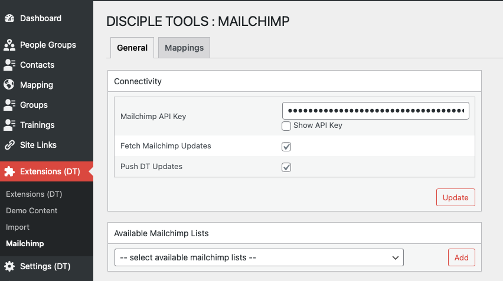
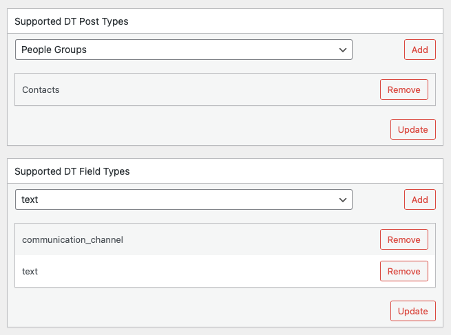
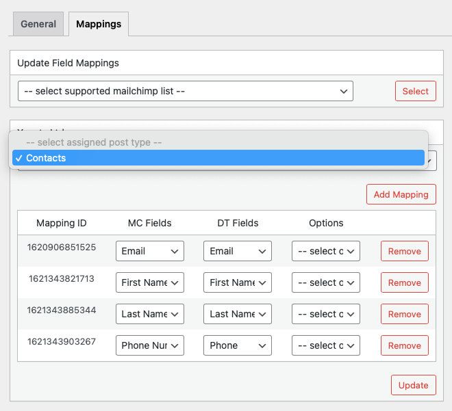

# Disciple Tools - Mailchimp

Integrate your Mailchimp audience lists with Disciple Tools and keep contact information continuously in sync between the two platforms.

## Purpose

This plugin further aids the marketing effort, by keeping mapped fields in sync across platforms, with little to no workflow disruption! New entries are automatically mirrored across both platforms!

## Usage

#### Will Do

- Control sync direction - Therefore, only accept Mailchimp updates; or just push D.T. updates; or temporarily disable sync runs in both directions.
- Cherry-pick Mailchimp lists to be kept in sync.
- Specify supported D.T. post types and field types.
- Create sync mappings between Mailchimp list & D.T. fields.
- Control sync direction at the field level.
- Automatically keep mapped fields in sync across Mailchimp & D.T. platforms.

#### Will Not Do

- Does not sync user metadata information such as activity feeds.

## Requirements

- Disciple Tools Theme installed on a Wordpress Server
- An activated Mailchimp account, with a valid API key.

## Installing

- Install as a standard Disciple.Tools/Wordpress plugin in the system Admin/Plugins area.
- Requires the user role of Administrator.

## Setup

- Install the plugin. (You must be an administrator)
- Activate the plugin.
- Navigate to the Extensions (D.T) > Mailchimp menu item in the admin area.
- Enter Mailchimp API key.
- Disable sync update flags in both directions, during initial setup.
- Save updates.
- Ensure to take backups of any pre-existing Mailchimp lists prior to adding any supported lists.
- Select and add supported Mailchimp lists.
- Select and add supported D.T. post and field types.
- Navigate to Mappings tab.
- For each selected supported Mailchimp list, assign a D.T. post type and create sync field mappings.
- Save mapping updates.
- Once all sync field mappings have been created for all lists, enable sync update flags (General Tab), one direction at a time; until all records have been linked and initially sync'd.
- Finally, enable sync runs in both directions and have the plugin take it from there! :)

## Contribution

Contributions welcome. You can report issues and bugs in the
[Issues](https://github.com/DiscipleTools/disciple-tools-mailchimp/issues) section of the repo. You can present ideas
in the [Discussions](https://github.com/DiscipleTools/disciple-tools-mailchimp/discussions) section of the repo. And
code contributions are welcome using the [Pull Request](https://github.com/DiscipleTools/disciple-tools-mailchimp/pulls)
system for git. For a more details on contribution see the
[contribution guidelines](https://github.com/DiscipleTools/disciple-tools-mailchimp/blob/master/CONTRIBUTING.md).

## Screenshots

